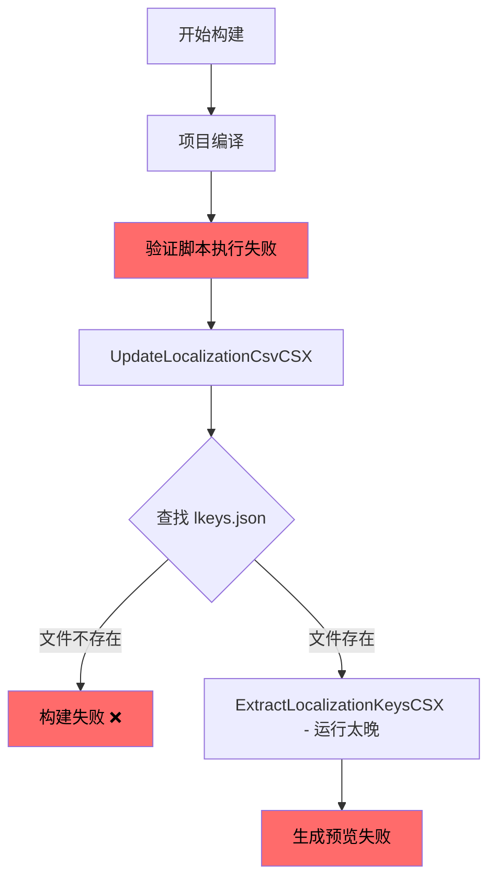
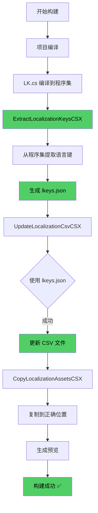
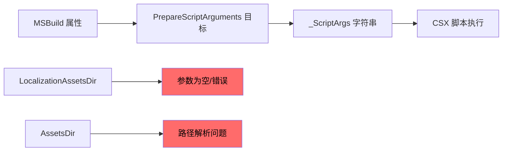
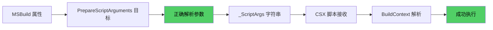
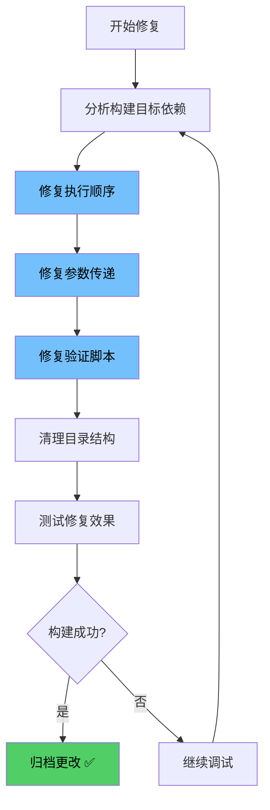

# Ducky SDK 构建流程分析

## 当前问题流程图



## 正确的预期流程图



## 关键问题详细分析

### 1. 构建目标执行顺序问题

**当前状态 (错误):**
```xml
<!-- 在 Orchestration.targets 中 -->
<Target Name="ProcessLocalization">
    <CallTarget Targets="UpdateLocalizationCsvCSX" />  <!-- ❌ 先运行 -->
    <CallTarget Targets="ExtractLocalizationKeysCSX" />  <!-- ❌ 后运行 -->
</Target>
```

**正确状态:**
```xml
<Target Name="ProcessLocalization">
    <CallTarget Targets="ExtractLocalizationKeysCSX" />  <!-- ✅ 先运行 -->
    <CallTarget Targets="UpdateLocalizationCsvCSX" />  <!-- ✅ 后运行 -->
</Target>
```

### 2. 脚本参数传递问题

**问题参数流:**


**正确参数流:**


### 3. 验证脚本上下文问题

**手动执行 vs MSBuild 执行差异:**

| 方面 | 手动执行 | MSBuild 执行 | 问题 |
|------|----------|--------------|------|
| 工作目录 | 项目根目录 | 可能不同目录 | 路径解析失败 |
| 参数传递 | 直接指定 | 通过 MSBuild 属性 | 参数丢失/错误 |
| 环境变量 | 用户环境 | 构建环境 | 依赖缺失 |
| 错误处理 | 可见输出 | 可能被截断 | 调试困难 |

## 修复方案流程图



## LK.cs 到 lkeys.json 转换流程

```mermaid
graph TD
    A[LK.cs 源文件] --> B[LanguageSupport 属性解析]
    B --> C[const 字符串提取]
    C --> D[程序集编译]
    D --> E[ExtractLocalizationKeysCSX 执行]
    E --> F[反射分析程序集]
    F --> G[提取语言代码 "en", "zh"]
    G --> H[提取键值 "NiceWelcomeMessage" 等]
    H --> I[生成 lkeys.json]
    I --> J[JSON 结构:]
    J --> K["{
  namespace: 'Ducky.EntranceMod.Common'
  supportedLanguages: ['en', 'zh']
  keys: ['ducky_entrancemod.common.ui.nicewelcomemessage']
}"]

    style E fill:#51cf66,color:#000000
    style I fill:#51cf66,color:#000000
```