# Ducky SDK 完整构建流程分析

## 系统架构概览

Ducky SDK 使用**混合 MSBuild-CSX 架构**，从纯粹的 MSBuild XML 目标演进到更易维护的 C# 驱动系统。

### 核心组件
- **Ducky.Sdk.props** - 属性初始化
- **Ducky.Sdk.targets** - 主要编排
- **Ducky.Sdk.Validation.targets** - 路径验证
- **Ducky.Sdk.Orchestration.targets** - CSX 脚本编排

## 完整构建生命周期

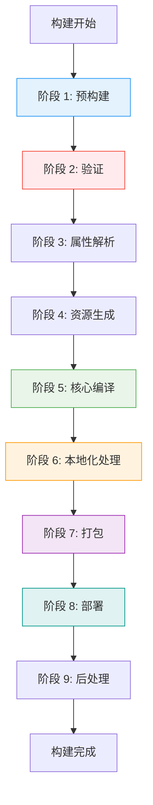

## 详细阶段分析

### 阶段 1: 预构建 (Ducky.Sdk.props)

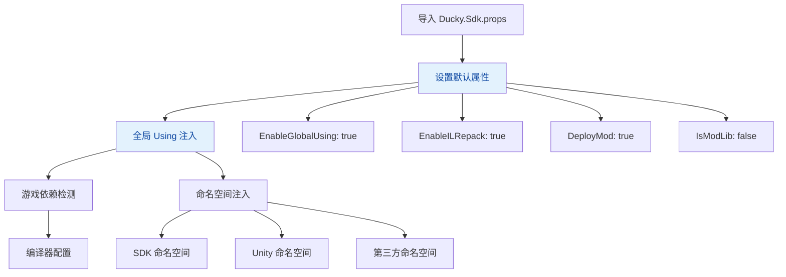

**关键任务**:
- 初始化所有 SDK 属性和默认值
- 注入全局 using 指令
- 设置编译器和调试属性
- 动态添加游戏程序集引用

### 阶段 2: 验证 (CSX 驱动)

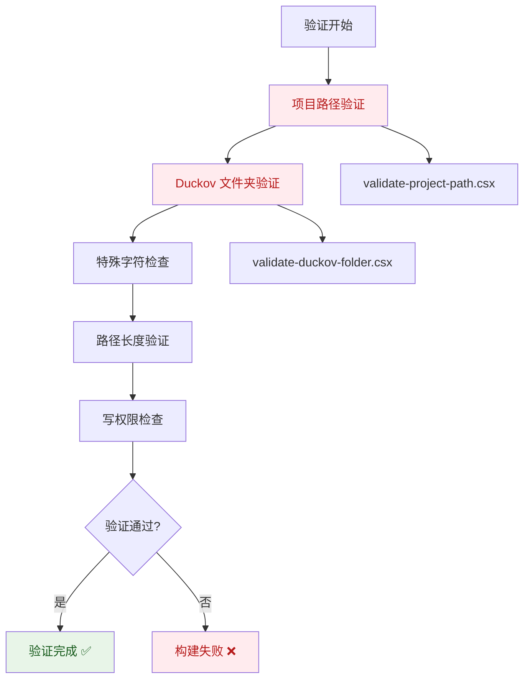

**验证脚本**:
- `validate-project-path.csx` - 检查特殊字符 (#, &, ;, |, <, >, `)
- `validate-duckov-folder.csx` - 验证游戏安装路径和必需文件

### 阶段 3: 属性解析 (resolve-sdk-properties.csx)

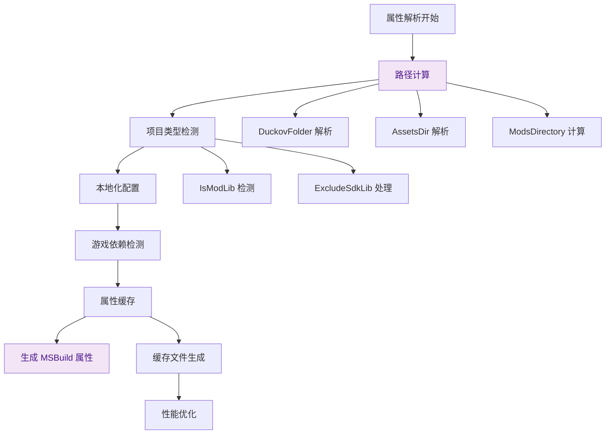

### 阶段 4: 资源生成 (CSX)

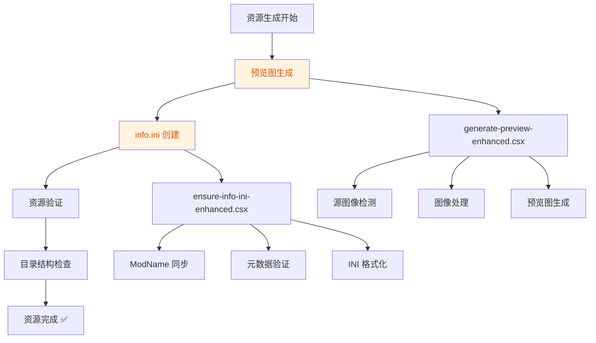

### 阶段 5: 核心编译

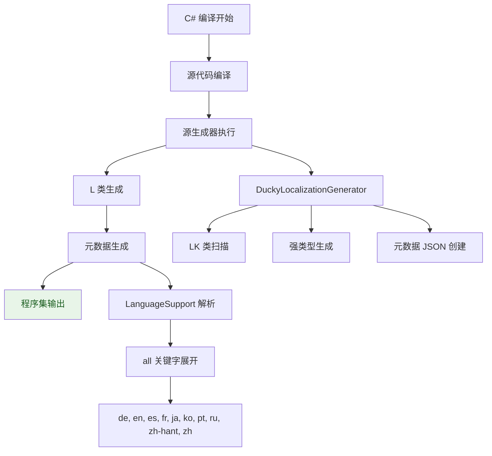

### 阶段 6: 本地化处理 (关键阶段)

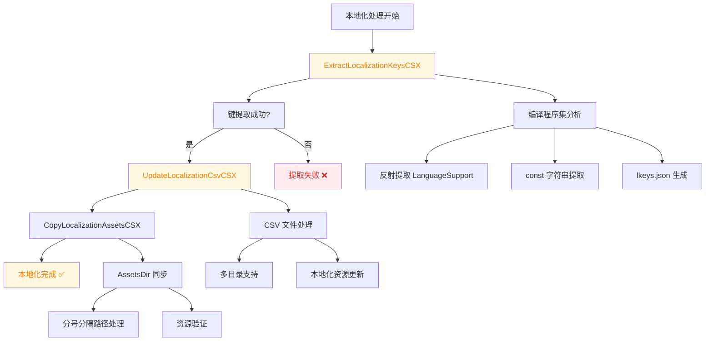

**❌ 当前问题**: 在实际构建中，`UpdateLocalizationCsvCSX` 在 `ExtractLocalizationKeysCSX` 之前运行，导致找不到 `lkeys.json` 文件。

### 阶段 7: 打包

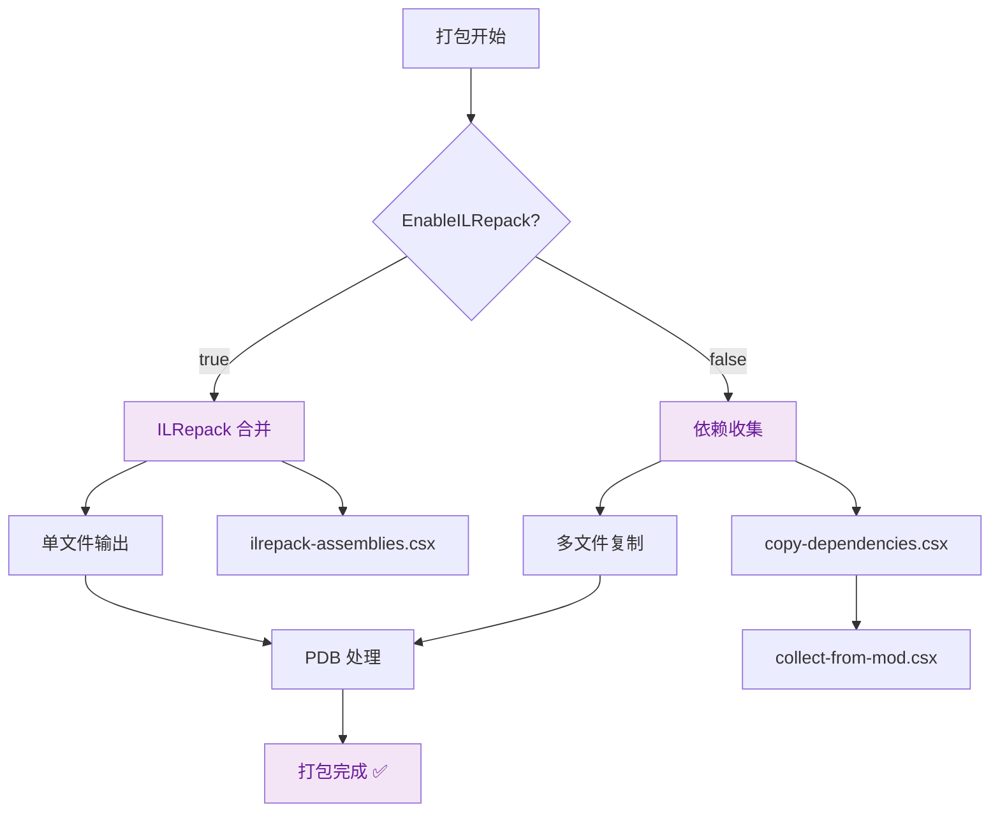

### 阶段 8: 部署

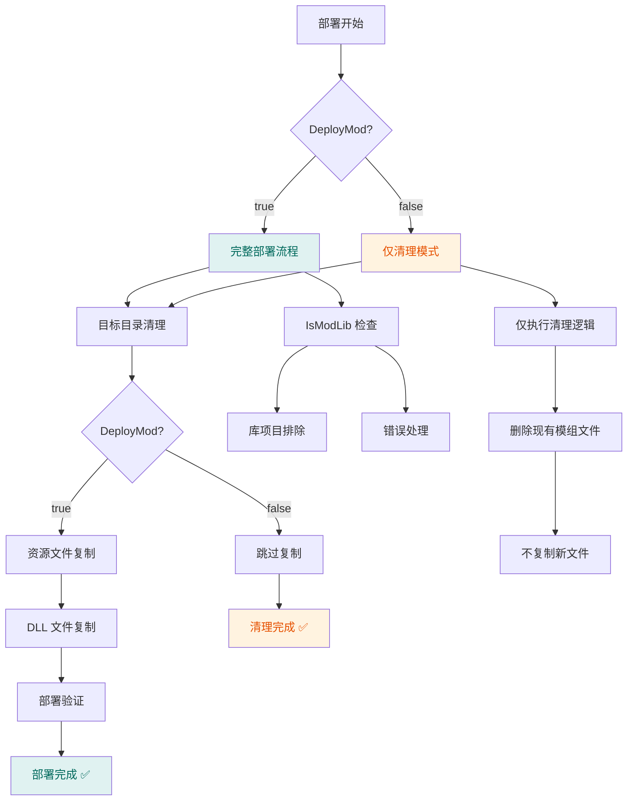

### ❌ 当前问题：DeployMod=false 逻辑
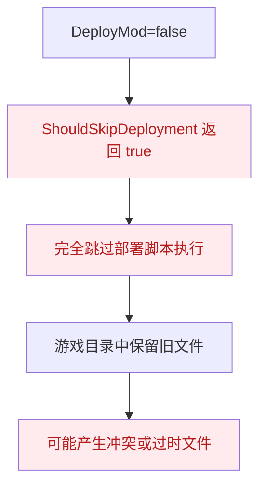

### ✅ 正确行为：清理模式
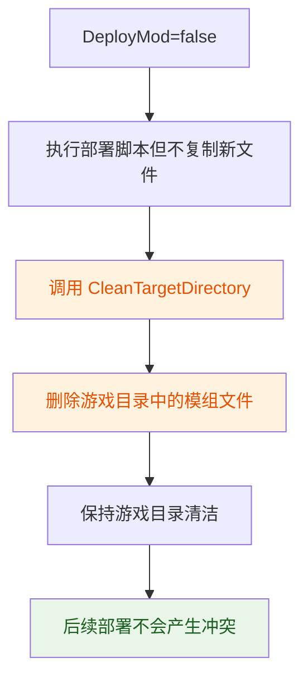

### 阶段 9: 后处理

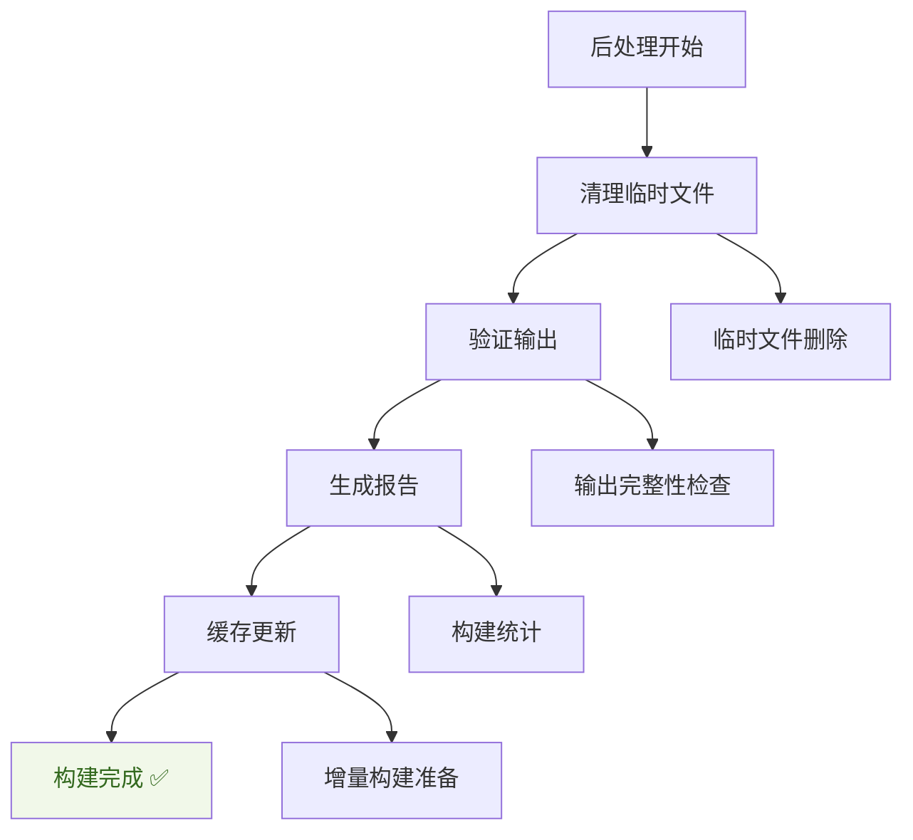

## 目标依赖关系图

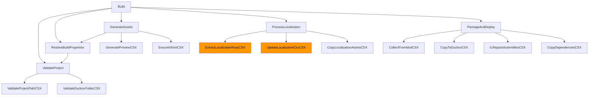

## 参数传递系统

### 标准 BuildContext 参数格式
```bash
--sdk-scripts-path <path> \
--project-dir <path> \
--configuration <config> \
--target-framework <tfm> \
--mod-name <name> \
--duckov-folder <path> \
--steam-folder <path> \
--assets-dir <path> \
--localization-assets-dir <path> \
--enable-ilrepack <bool> \
--enable-global-using <bool> \
--include-harmony <bool> \
--deploy-mod <bool> \
--exclude-sdk-lib <bool> \
--is-mod-lib <bool>
```

## 性能优化特性

1. **缓存系统** - 属性和本地化键缓存
2. **条件执行** - 根据项目类型跳过不必要步骤
3. **增量构建** - 源生成器集成
4. **多目录支持** - 优化的资源复制
5. **详细日志控制** - minimal, normal, detailed, diagnostic

## 关键失败点

### 🔴 当前关键问题
- **本地化处理顺序错误** - `UpdateLocalizationCsvCSX` 在 `ExtractLocalizationKeysCSX` 前执行
- **参数传递问题** - `LocalizationAssetsDir` 和 `AssetsDir` 解析错误
- **验证脚本上下文** - MSBuild 环境与手动执行环境差异

### 🟡 潜在风险点
- ILRepack 合并冲突
- 游戏依赖检测失败
- 路径特殊字符问题
- 权限不足导致的写入失败

这个完整的构建流程分析为修复方案提供了清晰的技术路线图和实施指导。