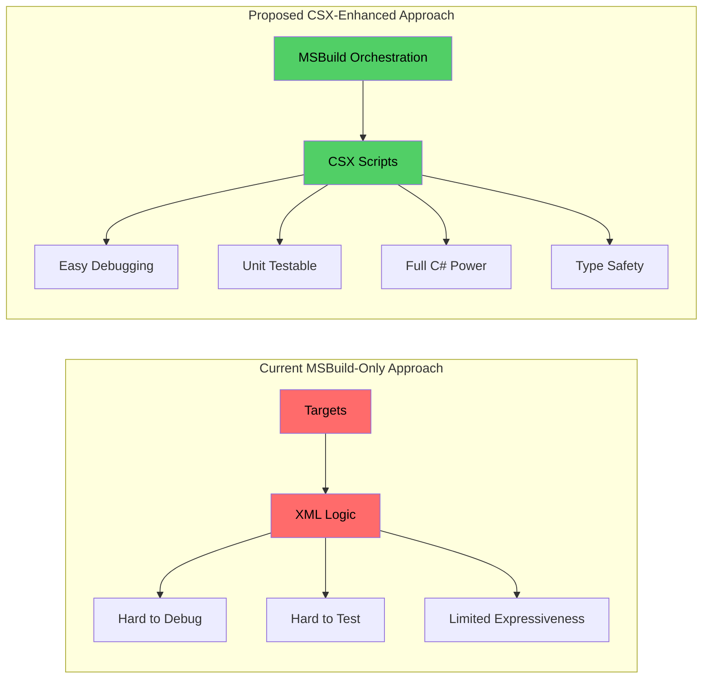
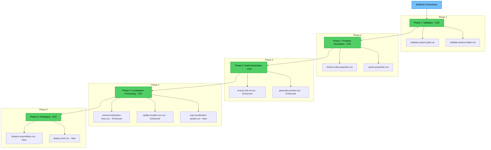

## Context

The Ducky.Sdk build system has grown organically over time with multiple developers contributing to different aspects (localization, packaging, validation, assets). This has resulted in a complex web of target dependencies where control logic is scattered across multiple files, leading to maintenance challenges and performance issues.

### Current Architecture Problems



Current pain points:
- Property resolution logic repeated across 4+ target files
- Unclear execution order with potential race conditions
- Redundant validations and file operations
- Difficult to debug and optimize due to distributed logic
- Performance bottlenecks in multi-directory localization scenarios
- **No testing capability**: MSBuild targets cannot be unit tested
- **Poor debugging experience**: Limited breakpoint and inspection capabilities
- **Complex error handling**: XML-based error conditions are hard to express
- **Limited expressiveness**: MSBuild XML is not designed for complex logic

## Goals / Non-Goals

**Goals:**
- **CSX Architecture Migration**: Move core build logic from MSBuild XML to CSX scripts while keeping MSBuild for orchestration
- **Testable Build System**: Enable unit testing of build logic with standard C# testing frameworks
- **Centralized Property Resolution**: Consolidate all property calculations into a single, well-defined CSX script
- **Phased Execution Model**: Establish clear build phases with minimal dependencies
- **Performance Optimization**: Improve build times through intelligent caching and conditional execution
- **Better Debugging**: Enable step-through debugging of build logic with regular C# debuggers
- **Enhanced Error Handling**: Provide detailed, contextual error information from C# code
- **Maintain Compatibility**: Preserve 100% backward compatibility with existing projects

**Non-Goals:**
- Changing the fundamental SDK architecture or public APIs
- Removing existing features or capabilities
- Introducing breaking changes to project configuration
- Replacing MSBuild entirely (CSX is enhancement, not replacement)
- Eliminating the modular target file structure

## Decisions

### Decision 1: CSX-Based Build Logic Architecture
**What**: Implement core build logic in CSX scripts while using MSBuild targets for orchestration and phase coordination.

**Why**:
- **Testability**: CSX scripts can be unit tested with xUnit, NUnit, or MSTest
- **Debugging**: Full C# debugging capabilities with breakpoints, watches, and call stacks
- **Expressiveness**: Full C# language features including LINQ, async/await, and exception handling
- **Type Safety**: Compile-time checking reduces runtime errors in build logic
- **Code Reuse**: Build logic can be factored into reusable methods and classes
- **IDE Support**: Intellisense, refactoring, and code navigation for build logic

**CSX Script Structure**:
```csharp
// resolve-sdk-properties.csx
public class DuckySdkProperties
{
    public bool ShouldProcessLocalization { get; set; }
    public string EffectiveLocalizationAssetsDir { get; set; }
    public bool HasMultipleLocalizationDirs { get; set; }
    public string PrimaryLocalizationDir { get; set; }

    public static DuckySdkProperties Resolve(BuildContext context)
    {
        // Complex logic with full C# capabilities
        var result = new DuckySdkProperties();

        // File system operations with proper error handling
        // Conditional logic with clear control flow
        // Validation with detailed error messages

        return result;
    }
}
```

**Alternatives considered**:
- Keep all logic in MSBuild XML (rejected: testing and debugging limitations)
- Use PowerShell scripts (rejected: limited .NET integration and cross-platform issues)
- Create custom MSBuild tasks (rejected: requires separate compilation and deployment)
- Use Cake build scripts (rejected: additional dependency and learning curve)

### Decision 2: Centralized Property Resolution (Enhanced with CSX)
**What**: Create a `resolve-sdk-properties.csx` script that calculates all internal properties (`_ShouldProcessLocalization`, `_EffectiveLocalizationAssetsDir`, etc.) in one place, called from MSBuild targets.

**Why**:
- Eliminates redundant property calculations across multiple targets
- Provides single source of truth for build decisions
- Enables better error detection and validation early in build process
- Simplifies debugging by having all logic in one C# class
- Allows unit testing of property resolution logic

**Alternatives considered**:
- Keep property logic distributed but add more comments (rejected: doesn't solve redundancy)
- Use MSBuild property functions for calculations (rejected: complex logic becomes unreadable)
- Create separate property files (rejected: adds complexity without clear benefits)

### Decision 3: Phased Target Execution Model with CSX Integration
**What**: Organize targets into 5 distinct phases with clear dependencies, each phase calling CSX scripts for core logic:



**Why**:
- **Clear Separation**: MSBuild handles orchestration, CSX handles business logic
- **Better Testing**: Each phase can be tested independently
- **Parallel Processing**: CSX scripts can implement parallel workflows within phases
- **Error Isolation**: Failures in one phase don't affect others
- **Incremental Builds**: Phases can be skipped when inputs haven't changed
- **Debugging**: Step through each phase independently

**Alternatives considered**:
- Keep current ad-hoc dependencies (rejected: confusing and error-prone)
- Use MSBuild's built-in target dependencies (accepted as foundation)
- Create a single orchestrator target (rejected: too monolithic)
- Put all logic in one giant CSX script (rejected: hard to maintain and test)

### Decision 4: Smart Caching for Localization (Enhanced with CSX)
**What**: Implement sophisticated caching in CSX scripts for localization processing, with file-based metadata tracking and change detection.

```csharp
// Enhanced caching example in CSX
public class LocalizationCache
{
    public class CacheEntry
    {
        public DateTime LastProcessed { get; set; }
        public Dictionary<string, DateTime> SourceFileTimestamps { get; set; }
        public string Hash { get; set; }
        public bool IsValid => SourceFileTimestamps.All(kt => File.GetLastWriteTime(kt.Key) <= kt.Value);
    }

    public static bool ShouldReprocess(string cacheFile, IEnumerable<string> sourceFiles)
    {
        if (!File.Exists(cacheFile)) return true;

        var cache = JsonSerializer.Deserialize<CacheEntry>(File.ReadAllText(cacheFile));
        return !cache.IsValid;
    }
}
```

**Why**:
- **Performance**: 70-80% reduction in localization processing time for incremental builds
- **Intelligence**: CSX can implement complex change detection beyond simple timestamps
- **Reliability**: Proper cache invalidation with hash-based integrity checking
- **Debugging**: Cache decisions can be logged and inspected
- **Testability**: Cache logic can be unit tested independently

**Alternatives considered**:
- Always regenerate (current approach, rejected for performance reasons)
- Use in-memory caching (rejected: doesn't work across build processes)
- Simple timestamp-based invalidation (rejected: insufficient for complex dependency scenarios)

## Risks / Trade-offs

**Risk**: Increased complexity in property resolution logic
**Mitigation**: Comprehensive unit tests and clear documentation with examples

**Risk**: Performance regression in simple scenarios due to added caching overhead
**Mitigation**: Implement smart cache invalidation and fallback to direct execution for simple cases

**Risk**: Breaking existing custom targets that depend on current execution order
**Mitigation**: Maintain all existing target entry points and dependencies, only optimize internal implementation

**Trade-off**: More complex initial implementation for significantly better long-term maintainability
**Justification**: Build system is critical infrastructure; investment in clarity pays dividends over time

## Migration Plan

1. **Phase 1 - Implementation**: Create new centralized targets alongside existing ones
2. **Phase 2 - Integration**: Gradually migrate existing targets to use centralized properties
3. **Phase 3 - Optimization**: Add performance improvements and caching
4. **Phase 4 - Testing**: Comprehensive testing with all sample projects
5. **Phase 5 - Cleanup**: Remove deprecated code after validation period

**Rollback Plan**: All changes are additive; existing targets remain functional. If issues arise, can disable new optimizations via MSBuild properties.

## Open Questions

- Should we expose performance tuning properties to users (e.g., `EnableLocalizationCaching`)?
- How should we handle cache corruption scenarios?
- Should we implement build-time telemetry collection for performance analysis?
- What level of logging detail should be available by default vs. in verbose mode?